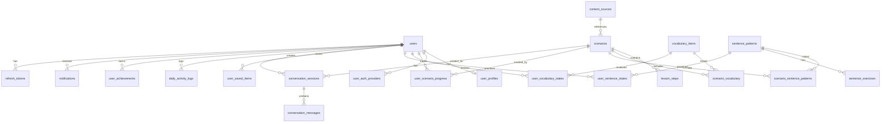

# LearnFlow 資料庫設計規格

> 版本：0.1.0  
> 最後更新：2026-06-13  
> 資料庫：PostgreSQL 16  
> 對應文件：[`PRODUCT_SPEC.md`](./PRODUCT_SPEC.md)、[`api.md`](./api.md)

---

## 1. 概述

LearnFlow 使用 **PostgreSQL** 作為主資料庫，儲存使用者、情境內容、學習進度、複習排程、AI 對話紀錄與收藏等高度關聯資料。彈性欄位（AI 回饋、對話訊息、練習題）使用 **JSONB**；未來語意搜尋可擴充 **pgvector**。

### 1.1 設計原則

| 原則 | 說明 |
|------|------|
| 正規化為主 | 核心實體拆表，避免冗餘 |
| JSONB 輔助 | 訊息列表、動態練習題、AI 結構化回饋 |
| 使用者資料隔離 | 所有個人進度表帶 `user_id`，加索引 |
| 軟刪除 | `users`、`scenarios` 使用 `deleted_at` |
| UTC 儲存 | 所有 timestamp 用 `timestamptz`，應用層轉本地時區 |
| UUID 主鍵 | 使用者相關表用 UUID；內容表可用 slug 或 UUID |

### 1.2 命名慣例

- 表名：複數 snake_case（`users`, `scenarios`）
- 主鍵：`id`
- 外鍵：`{表名單數}_id`（`user_id`, `scenario_id`）
- 時間戳：`created_at`, `updated_at`
- 列舉：PostgreSQL `ENUM` 或 `VARCHAR` + CHECK

---

## 2. ER 關係圖



---

## 3. 列舉型別（ENUM）

```sql
CREATE TYPE language_code AS ENUM ('english', 'japanese', 'korean');
CREATE TYPE level_code AS ENUM ('beginner', 'intermediate', 'advanced');
CREATE TYPE source_status AS ENUM ('licensed', 'summarized', 'attribution_required');
CREATE TYPE lesson_step_type AS ENUM (
  'story', 'listening', 'reading', 'vocabulary',
  'sentence_pattern', 'speaking', 'conversation', 'quiz', 'result'
);
CREATE TYPE conversation_mode AS ENUM (
  'roleplay', 'drama_task', 'news_discussion', 'free_practice'
);
CREATE TYPE saved_item_type AS ENUM (
  'scenario', 'vocabulary', 'sentence', 'conversation', 'news'
);
CREATE TYPE subscription_tier AS ENUM ('free', 'pro');
CREATE TYPE activity_level AS ENUM ('none', 'partial', 'full');
CREATE TYPE auth_provider AS ENUM ('email', 'google');
CREATE TYPE step_result AS ENUM ('mastered', 'needs_review', 'skipped');
CREATE TYPE notification_type AS ENUM (
  'daily_reminder', 'streak', 'achievement', 'review_due', 'system'
);
```

---

## 4. 使用者與認證

### 4.1 `users` — 使用者帳號

| 欄位 | 型別 | 約束 | 說明 |
|------|------|------|------|
| id | UUID | PK, DEFAULT gen_random_uuid() | |
| email | VARCHAR(255) | UNIQUE, NOT NULL | 登入 email |
| password_hash | VARCHAR(255) | NULL | OAuth 使用者可為 NULL |
| name | VARCHAR(100) | NOT NULL | 顯示名稱 |
| avatar_url | TEXT | NULL | 頭像 |
| subscription_tier | subscription_tier | NOT NULL DEFAULT 'free' | |
| email_verified_at | TIMESTAMPTZ | NULL | |
| last_login_at | TIMESTAMPTZ | NULL | |
| created_at | TIMESTAMPTZ | NOT NULL DEFAULT now() | |
| updated_at | TIMESTAMPTZ | NOT NULL DEFAULT now() | |
| deleted_at | TIMESTAMPTZ | NULL | 軟刪除 |

**索引**

```sql
CREATE UNIQUE INDEX idx_users_email ON users (email) WHERE deleted_at IS NULL;
CREATE INDEX idx_users_created_at ON users (created_at);
```

---

### 4.2 `user_auth_providers` — 第三方登入

| 欄位 | 型別 | 約束 | 說明 |
|------|------|------|------|
| id | UUID | PK | |
| user_id | UUID | FK → users.id, NOT NULL | |
| provider | auth_provider | NOT NULL | email / google |
| provider_user_id | VARCHAR(255) | NOT NULL | Google sub |
| created_at | TIMESTAMPTZ | NOT NULL DEFAULT now() | |

**索引**

```sql
CREATE UNIQUE INDEX idx_auth_provider_unique
  ON user_auth_providers (provider, provider_user_id);
CREATE INDEX idx_auth_provider_user ON user_auth_providers (user_id);
```

---

### 4.3 `user_profiles` — 學習偏好（1:1 users）

| 欄位 | 型別 | 約束 | 說明 |
|------|------|------|------|
| user_id | UUID | PK, FK → users.id | |
| native_language | VARCHAR(10) | NOT NULL DEFAULT 'zh-TW' | |
| active_languages | language_code[] | NOT NULL DEFAULT '{}' | |
| level | level_code | NOT NULL DEFAULT 'beginner' | |
| interests | TEXT[] | NOT NULL DEFAULT '{}' | 影劇、旅行… |
| daily_goal_minutes | SMALLINT | NOT NULL DEFAULT 30 | |
| speech_speed | DECIMAL(3,2) | NOT NULL DEFAULT 1.00 | 0.75~1.50 |
| ai_feedback_strictness | VARCHAR(20) | NOT NULL DEFAULT 'normal' | gentle/normal/strict |
| ui_language | VARCHAR(10) | NOT NULL DEFAULT 'zh-TW' | |
| timezone | VARCHAR(50) | NOT NULL DEFAULT 'Asia/Taipei' |  streak 計算用 |
| updated_at | TIMESTAMPTZ | NOT NULL DEFAULT now() | |

---

### 4.4 `refresh_tokens` — JWT Refresh Token

| 欄位 | 型別 | 約束 | 說明 |
|------|------|------|------|
| id | UUID | PK | |
| user_id | UUID | FK → users.id, NOT NULL | |
| token_hash | VARCHAR(255) | NOT NULL | 存 hash 不存明文 |
| expires_at | TIMESTAMPTZ | NOT NULL | |
| revoked_at | TIMESTAMPTZ | NULL | |
| created_at | TIMESTAMPTZ | NOT NULL DEFAULT now() | |

**索引**

```sql
CREATE INDEX idx_refresh_tokens_user ON refresh_tokens (user_id);
CREATE INDEX idx_refresh_tokens_hash ON refresh_tokens (token_hash);
```

---

### 4.5 `password_reset_tokens` — 重設密碼

| 欄位 | 型別 | 約束 | 說明 |
|------|------|------|------|
| id | UUID | PK | |
| user_id | UUID | FK → users.id, NOT NULL | |
| token_hash | VARCHAR(255) | NOT NULL | |
| expires_at | TIMESTAMPTZ | NOT NULL | |
| used_at | TIMESTAMPTZ | NULL | |
| created_at | TIMESTAMPTZ | NOT NULL DEFAULT now() | |

---

## 5. 內容與情境

### 5.1 `content_sources` — 內容來源

| 欄位 | 型別 | 約束 | 說明 |
|------|------|------|------|
| id | UUID | PK | |
| name | VARCHAR(255) | NOT NULL | 來源名稱 |
| url | TEXT | NOT NULL | |
| published_at | DATE | NULL | |
| status | source_status | NOT NULL | licensed / summarized / attribution_required |
| summary | TEXT | NOT NULL | |
| content_type | VARCHAR(50) | NOT NULL | news / travel / drama / learning |
| created_at | TIMESTAMPTZ | NOT NULL DEFAULT now() | |

---

### 5.2 `scenarios` — 情境學習任務

| 欄位 | 型別 | 約束 | 說明 |
|------|------|------|------|
| id | VARCHAR(50) | PK | slug，如 `jp-cafe-001` |
| title | VARCHAR(255) | NOT NULL | |
| language | language_code | NOT NULL | |
| level | level_code | NOT NULL | |
| category | VARCHAR(50) | NOT NULL | 旅行、影劇、時事… |
| topic_tags | TEXT[] | NOT NULL DEFAULT '{}' | |
| skill_focus | TEXT[] | NOT NULL DEFAULT '{}' | |
| estimated_minutes | SMALLINT | NOT NULL | |
| story | TEXT | NOT NULL | 情境故事 |
| mission | TEXT | NOT NULL | 任務目標 |
| is_voice_enabled | BOOLEAN | NOT NULL DEFAULT false | |
| is_published | BOOLEAN | NOT NULL DEFAULT true | |
| is_beta | BOOLEAN | NOT NULL DEFAULT false | 韓文 Beta |
| source_id | UUID | FK → content_sources.id | |
| thumbnail_url | TEXT | NULL | |
| sort_order | INT | NOT NULL DEFAULT 0 | |
| view_count | INT | NOT NULL DEFAULT 0 | 熱門排序用 |
| created_at | TIMESTAMPTZ | NOT NULL DEFAULT now() | |
| updated_at | TIMESTAMPTZ | NOT NULL DEFAULT now() | |
| deleted_at | TIMESTAMPTZ | NULL | |

**索引**

```sql
CREATE INDEX idx_scenarios_language ON scenarios (language) WHERE deleted_at IS NULL;
CREATE INDEX idx_scenarios_category ON scenarios (category);
CREATE INDEX idx_scenarios_level ON scenarios (level);
CREATE INDEX idx_scenarios_tags ON scenarios USING GIN (topic_tags);
CREATE INDEX idx_scenarios_published ON scenarios (is_published, language);
```

---

### 5.3 `lesson_steps` — 情境學習步驟

| 欄位 | 型別 | 約束 | 說明 |
|------|------|------|------|
| id | VARCHAR(50) | PK | 如 `opening`, `listening` |
| scenario_id | VARCHAR(50) | FK → scenarios.id, NOT NULL | |
| title | VARCHAR(100) | NOT NULL | |
| type | lesson_step_type | NOT NULL | |
| order_index | SMALLINT | NOT NULL | 步驟順序 |
| instruction | TEXT | NOT NULL | |
| primary_text | TEXT | NOT NULL | 目標語言文本 |
| support_text | TEXT | NULL | 讀音/假名/羅馬拼音 |
| translation | TEXT | NOT NULL | 中文翻譯 |
| audio_url | TEXT | NULL | TTS 音檔 |
| metadata | JSONB | NULL | 額外設定 |
| created_at | TIMESTAMPTZ | NOT NULL DEFAULT now() | |

**索引**

```sql
CREATE UNIQUE INDEX idx_lesson_steps_order
  ON lesson_steps (scenario_id, order_index);
CREATE INDEX idx_lesson_steps_scenario ON lesson_steps (scenario_id);
```

---

## 6. 單字與句型

### 6.1 `vocabulary_items` — 單字（全域詞庫）

| 欄位 | 型別 | 約束 | 說明 |
|------|------|------|------|
| id | VARCHAR(50) | PK | 如 `v1` |
| term | VARCHAR(100) | NOT NULL | |
| reading | VARCHAR(200) | NULL | 讀音 |
| meaning | TEXT | NOT NULL | 中文意思 |
| example | TEXT | NULL | 例句 |
| language | language_code | NOT NULL | |
| audio_url | TEXT | NULL | |
| created_at | TIMESTAMPTZ | NOT NULL DEFAULT now() | |

**索引**

```sql
CREATE INDEX idx_vocabulary_language ON vocabulary_items (language);
CREATE INDEX idx_vocabulary_term ON vocabulary_items (term);
```

---

### 6.2 `scenario_vocabulary` — 情境 ↔ 單字（多對多）

| 欄位 | 型別 | 約束 | 說明 |
|------|------|------|------|
| scenario_id | VARCHAR(50) | FK → scenarios.id | |
| vocabulary_id | VARCHAR(50) | FK → vocabulary_items.id | |
| order_index | SMALLINT | NOT NULL DEFAULT 0 | |

**主鍵**: `(scenario_id, vocabulary_id)`

---

### 6.3 `sentence_patterns` — 句型

| 欄位 | 型別 | 約束 | 說明 |
|------|------|------|------|
| id | VARCHAR(50) | PK | |
| pattern | VARCHAR(255) | NOT NULL | 句型模板 |
| explanation | TEXT | NOT NULL | |
| example | TEXT | NOT NULL | |
| practice_prompt | TEXT | NOT NULL | |
| language | language_code | NOT NULL | |
| created_at | TIMESTAMPTZ | NOT NULL DEFAULT now() | |

---

### 6.4 `scenario_sentence_patterns` — 情境 ↔ 句型

| 欄位 | 型別 | 約束 | 說明 |
|------|------|------|------|
| scenario_id | VARCHAR(50) | FK | |
| sentence_pattern_id | VARCHAR(50) | FK | |
| order_index | SMALLINT | NOT NULL DEFAULT 0 | |

**主鍵**: `(scenario_id, sentence_pattern_id)`

---

### 6.5 `sentence_exercises` — 句型練習題

| 欄位 | 型別 | 約束 | 說明 |
|------|------|------|------|
| id | UUID | PK | |
| sentence_pattern_id | VARCHAR(50) | FK → sentence_patterns.id | |
| type | VARCHAR(30) | NOT NULL | fill_blank / reorder / translate / shadowing |
| prompt | TEXT | NOT NULL | 題目 |
| expected_answer | TEXT | NOT NULL | 標準答案 |
| hint | TEXT | NULL | |
| options | JSONB | NULL | 選擇題選項 |
| order_index | SMALLINT | NOT NULL DEFAULT 0 | |

---

## 7. 使用者學習狀態

### 7.1 `user_scenario_progress` — 情境進度

| 欄位 | 型別 | 約束 | 說明 |
|------|------|------|------|
| id | UUID | PK | |
| user_id | UUID | FK → users.id, NOT NULL | |
| scenario_id | VARCHAR(50) | FK → scenarios.id, NOT NULL | |
| progress_percent | SMALLINT | NOT NULL DEFAULT 0 | 0-100 |
| completed_step_id | VARCHAR(50) | NULL | 目前步驟 |
| completed_step_index | SMALLINT | NOT NULL DEFAULT 0 | |
| score | SMALLINT | NULL | 完成分數 |
| minutes_spent | INT | NOT NULL DEFAULT 0 | 累計分鐘 |
| mistakes | JSONB | NOT NULL DEFAULT '[]' | 錯誤紀錄 |
| status | VARCHAR(20) | NOT NULL DEFAULT 'in_progress' | in_progress / completed / archived |
| started_at | TIMESTAMPTZ | NOT NULL DEFAULT now() | |
| last_studied_at | TIMESTAMPTZ | NULL | |
| completed_at | TIMESTAMPTZ | NULL | |
| next_review_at | TIMESTAMPTZ | NULL | SRS 到期 |
| created_at | TIMESTAMPTZ | NOT NULL DEFAULT now() | |
| updated_at | TIMESTAMPTZ | NOT NULL DEFAULT now() | |

**索引**

```sql
CREATE UNIQUE INDEX idx_user_scenario_unique ON user_scenario_progress (user_id, scenario_id);
CREATE INDEX idx_user_scenario_review ON user_scenario_progress (user_id, next_review_at);
CREATE INDEX idx_user_scenario_status ON user_scenario_progress (user_id, status);
```

---

### 7.2 `user_vocabulary_states` — 單字複習狀態（SM-2）

| 欄位 | 型別 | 約束 | 說明 |
|------|------|------|------|
| id | UUID | PK | |
| user_id | UUID | FK, NOT NULL | |
| vocabulary_id | VARCHAR(50) | FK, NOT NULL | |
| source_scenario_id | VARCHAR(50) | FK, NULL | 首次學習來源 |
| familiarity | SMALLINT | NOT NULL DEFAULT 0 | 0-100 熟悉度 |
| ease_factor | DECIMAL(4,2) | NOT NULL DEFAULT 2.50 | SM-2 EF |
| interval_days | INT | NOT NULL DEFAULT 0 | |
| repetitions | INT | NOT NULL DEFAULT 0 | |
| next_review_at | TIMESTAMPTZ | NULL | |
| last_reviewed_at | TIMESTAMPTZ | NULL | |
| is_favorited | BOOLEAN | NOT NULL DEFAULT false | |
| created_at | TIMESTAMPTZ | NOT NULL DEFAULT now() | |
| updated_at | TIMESTAMPTZ | NOT NULL DEFAULT now() | |

**索引**

```sql
CREATE UNIQUE INDEX idx_user_vocab_unique ON user_vocabulary_states (user_id, vocabulary_id);
CREATE INDEX idx_user_vocab_due ON user_vocabulary_states (user_id, next_review_at);
CREATE INDEX idx_user_vocab_familiarity ON user_vocabulary_states (user_id, familiarity);
```

---

### 7.3 `user_sentence_states` — 句型練習狀態

| 欄位 | 型別 | 約束 | 說明 |
|------|------|------|------|
| id | UUID | PK | |
| user_id | UUID | FK, NOT NULL | |
| sentence_pattern_id | VARCHAR(50) | FK, NOT NULL | |
| attempts | INT | NOT NULL DEFAULT 0 | |
| correct_count | INT | NOT NULL DEFAULT 0 | |
| ease_factor | DECIMAL(4,2) | NOT NULL DEFAULT 2.50 | |
| interval_days | INT | NOT NULL DEFAULT 0 | |
| next_review_at | TIMESTAMPTZ | NULL | |
| last_practiced_at | TIMESTAMPTZ | NULL | |
| created_at | TIMESTAMPTZ | NOT NULL DEFAULT now() | |
| updated_at | TIMESTAMPTZ | NOT NULL DEFAULT now() | |

**索引**

```sql
CREATE UNIQUE INDEX idx_user_sentence_unique
  ON user_sentence_states (user_id, sentence_pattern_id);
CREATE INDEX idx_user_sentence_due ON user_sentence_states (user_id, next_review_at);
```

---

### 7.4 `user_step_completions` — 步驟完成紀錄（事件 log）

| 欄位 | 型別 | 約束 | 說明 |
|------|------|------|------|
| id | UUID | PK | |
| user_id | UUID | FK, NOT NULL | |
| scenario_id | VARCHAR(50) | FK, NOT NULL | |
| step_id | VARCHAR(50) | FK, NOT NULL | |
| result | step_result | NOT NULL | |
| minutes_spent | SMALLINT | NOT NULL DEFAULT 0 | |
| created_at | TIMESTAMPTZ | NOT NULL DEFAULT now() | |

**索引**

```sql
CREATE INDEX idx_step_completions_user ON user_step_completions (user_id, created_at DESC);
```

---

## 8. AI 對話

### 8.1 `conversation_sessions` — 對話 session

| 欄位 | 型別 | 約束 | 說明 |
|------|------|------|------|
| id | UUID | PK | |
| user_id | UUID | FK → users.id, NOT NULL | |
| scenario_id | VARCHAR(50) | FK → scenarios.id, NULL | 可為自由練習 |
| mode | conversation_mode | NOT NULL | |
| role_setting | JSONB | NOT NULL DEFAULT '{}' | AI/使用者角色設定 |
| score | SMALLINT | NULL | 結束後總分 |
| feedback | JSONB | NULL | 結構化回饋 |
| recommended_review | TEXT[] | NULL | 建議複習項目 |
| turn_count | SMALLINT | NOT NULL DEFAULT 0 | |
| max_turns | SMALLINT | NOT NULL DEFAULT 8 | |
| status | VARCHAR(20) | NOT NULL DEFAULT 'active' | active / completed / abandoned |
| started_at | TIMESTAMPTZ | NOT NULL DEFAULT now() | |
| completed_at | TIMESTAMPTZ | NULL | |
| created_at | TIMESTAMPTZ | NOT NULL DEFAULT now() | |

**索引**

```sql
CREATE INDEX idx_conv_sessions_user ON conversation_sessions (user_id, created_at DESC);
CREATE INDEX idx_conv_sessions_scenario ON conversation_sessions (scenario_id);
```

**`feedback` JSONB 範例**

```json
{
  "naturalness": 85,
  "grammar": 90,
  "vocabulary": 80,
  "pronunciation": null,
  "politeness": 88,
  "summary": "整體表現良好",
  "strengths": ["句型運用正確"],
  "improvements": ["語調可更自然"]
}
```

---

### 8.2 `conversation_messages` — 對話訊息

| 欄位 | 型別 | 約束 | 說明 |
|------|------|------|------|
| id | UUID | PK | |
| session_id | UUID | FK → conversation_sessions.id, NOT NULL | |
| role | VARCHAR(10) | NOT NULL | user / assistant / system |
| speaker | VARCHAR(50) | NULL | 顯示名稱，如「AI 店員」 |
| target_text | TEXT | NOT NULL | 目標語言 |
| reading | TEXT | NULL | 讀音 |
| translation | TEXT | NULL | 翻譯 |
| feedback | TEXT | NULL | 本輪回饋 |
| metadata | JSONB | NULL | |
| created_at | TIMESTAMPTZ | NOT NULL DEFAULT now() | |

**索引**

```sql
CREATE INDEX idx_conv_messages_session ON conversation_messages (session_id, created_at);
```

---

## 9. 收藏

### 9.1 `user_saved_items` — 使用者收藏

| 欄位 | 型別 | 約束 | 說明 |
|------|------|------|------|
| id | UUID | PK | |
| user_id | UUID | FK, NOT NULL | |
| item_type | saved_item_type | NOT NULL | |
| item_id | VARCHAR(100) | NOT NULL | 對應資源 ID |
| created_at | TIMESTAMPTZ | NOT NULL DEFAULT now() | |

**索引**

```sql
CREATE UNIQUE INDEX idx_saved_unique ON user_saved_items (user_id, item_type, item_id);
CREATE INDEX idx_saved_user_type ON user_saved_items (user_id, item_type);
```

---

## 10. 活動、Streak 與成就

### 10.1 `daily_activity_logs` — 每日學習紀錄

| 欄位 | 型別 | 約束 | 說明 |
|------|------|------|------|
| id | UUID | PK | |
| user_id | UUID | FK, NOT NULL | |
| activity_date | DATE | NOT NULL | 使用者本地日期 |
| minutes_spent | INT | NOT NULL DEFAULT 0 | |
| scenarios_completed | SMALLINT | NOT NULL DEFAULT 0 | |
| vocabulary_reviewed | SMALLINT | NOT NULL DEFAULT 0 | |
| sentences_practiced | SMALLINT | NOT NULL DEFAULT 0 | |
| conversations_completed | SMALLINT | NOT NULL DEFAULT 0 | |
| goal_minutes | SMALLINT | NOT NULL | 當日目標快照 |
| activity_level | activity_level | NOT NULL DEFAULT 'none' | |
| created_at | TIMESTAMPTZ | NOT NULL DEFAULT now() | |
| updated_at | TIMESTAMPTZ | NOT NULL DEFAULT now() | |

**索引**

```sql
CREATE UNIQUE INDEX idx_daily_activity_unique ON daily_activity_logs (user_id, activity_date);
CREATE INDEX idx_daily_activity_date ON daily_activity_logs (user_id, activity_date DESC);
```

**`activity_level` 計算邏輯**

- `none`: minutes = 0
- `partial`: 0 < minutes < goal
- `full`: minutes >= goal

---

### 10.2 `user_streaks` — 連續學習（可從 daily_activity_logs 計算，也可快取）

| 欄位 | 型別 | 約束 | 說明 |
|------|------|------|------|
| user_id | UUID | PK, FK → users.id | |
| current_streak | INT | NOT NULL DEFAULT 0 | |
| best_streak | INT | NOT NULL DEFAULT 0 | |
| last_active_date | DATE | NULL | |
| updated_at | TIMESTAMPTZ | NOT NULL DEFAULT now() | |

---

### 10.3 `achievements` — 成就定義

| 欄位 | 型別 | 約束 | 說明 |
|------|------|------|------|
| id | VARCHAR(50) | PK | 如 `first_cafe_scenario` |
| title | VARCHAR(100) | NOT NULL | |
| description | TEXT | NOT NULL | |
| icon | VARCHAR(50) | NULL | |
| criteria | JSONB | NOT NULL | 解鎖條件 |
| created_at | TIMESTAMPTZ | NOT NULL DEFAULT now() | |

---

### 10.4 `user_achievements` — 使用者已解鎖成就

| 欄位 | 型別 | 約束 | 說明 |
|------|------|------|------|
| user_id | UUID | FK | |
| achievement_id | VARCHAR(50) | FK | |
| unlocked_at | TIMESTAMPTZ | NOT NULL DEFAULT now() | |

**主鍵**: `(user_id, achievement_id)`

---

## 11. 通知

### 11.1 `notifications` — 使用者通知

| 欄位 | 型別 | 約束 | 說明 |
|------|------|------|------|
| id | UUID | PK | |
| user_id | UUID | FK, NOT NULL | |
| type | notification_type | NOT NULL | |
| title | VARCHAR(255) | NOT NULL | |
| body | TEXT | NULL | |
| payload | JSONB | NULL | 深連結等 |
| is_read | BOOLEAN | NOT NULL DEFAULT false | |
| created_at | TIMESTAMPTZ | NOT NULL DEFAULT now() | |

**索引**

```sql
CREATE INDEX idx_notifications_user ON notifications (user_id, is_read, created_at DESC);
```

---

## 12. 常用查詢範例

### 12.1 首頁 Dashboard 統計

```sql
-- 今日進度
SELECT
  dal.minutes_spent,
  up.daily_goal_minutes AS goal_minutes,
  dal.scenarios_completed,
  us.current_streak,
  us.best_streak
FROM users u
JOIN user_profiles up ON up.user_id = u.id
LEFT JOIN daily_activity_logs dal
  ON dal.user_id = u.id AND dal.activity_date = CURRENT_DATE
LEFT JOIN user_streaks us ON us.user_id = u.id
WHERE u.id = $1;

-- 完成率 = minutes_spent / goal_minutes * 100
```

### 12.2 繼續學習（最近 in_progress 情境）

```sql
SELECT s.*, usp.progress_percent, usp.completed_step_id
FROM user_scenario_progress usp
JOIN scenarios s ON s.id = usp.scenario_id
WHERE usp.user_id = $1
  AND usp.status = 'in_progress'
  AND s.deleted_at IS NULL
ORDER BY usp.last_studied_at DESC NULLS LAST
LIMIT 1;
```

### 12.3 今日待複習單字

```sql
SELECT vi.*, uvs.familiarity, uvs.next_review_at
FROM user_vocabulary_states uvs
JOIN vocabulary_items vi ON vi.id = uvs.vocabulary_id
WHERE uvs.user_id = $1
  AND uvs.next_review_at <= now()
ORDER BY uvs.next_review_at ASC
LIMIT 20;
```

### 12.4 學習日曆（某月）

```sql
SELECT activity_date, minutes_spent, scenarios_completed, activity_level
FROM daily_activity_logs
WHERE user_id = $1
  AND activity_date >= $2  -- month start
  AND activity_date < $3   -- month end
ORDER BY activity_date;
```

### 12.5 個人化推薦（簡化版）

```sql
SELECT s.*
FROM scenarios s
JOIN user_profiles up ON up.user_id = $1
WHERE s.deleted_at IS NULL
  AND s.is_published = true
  AND s.language = ANY(up.active_languages)
  AND s.topic_tags && up.interests  -- 陣列交集
  AND s.id NOT IN (
    SELECT scenario_id FROM user_scenario_progress
    WHERE user_id = $1 AND status = 'completed'
  )
ORDER BY s.view_count DESC, s.created_at DESC
LIMIT 6;
```

---

## 13. SM-2 複習演算法（單字）

`user_vocabulary_states` 使用 SM-2 間隔重複：

```
輸入 quality (0-5):
  0-2: repetitions = 0, interval = 1
  3+:  repetitions += 1
       if repetitions == 1: interval = 1
       elif repetitions == 2: interval = 6
       else: interval = round(interval * ease_factor)

ease_factor = max(1.3, ease_factor + (0.1 - (5 - quality) * (0.08 + (5 - quality) * 0.02)))

next_review_at = now() + interval days
familiarity = min(100, familiarity + quality * 5)
```

可在應用層實作，DB 只存結果。

---

## 14. 種子資料（Seed）

第一階段 migration 後匯入 mock data 對應內容：

| 表 | 資料來源 |
|----|----------|
| content_sources | `mock_data.py` → sources |
| scenarios | `mock_data.py` → scenarios |
| lesson_steps | `mock_data.py` → lesson_steps |
| vocabulary_items | `mock_data.py` → vocabulary |
| sentence_patterns | `mock_data.py` → sentence_patterns |
| scenario_vocabulary | 依 source_scenario 關聯 |
| scenario_sentence_patterns | 依情境關聯 |
| achievements | 產品規格 §9 成就列表 |

---

## 15. Migration 策略

### 15.1 目錄結構（建議）

```text
app/backend/database/
  connection.py
  migrations/
    001_init_enums.sql
    002_users_and_auth.sql
    003_content_and_scenarios.sql
    004_vocabulary_and_sentences.sql
    005_user_progress.sql
    006_conversations.sql
    007_activity_and_achievements.sql
    008_notifications.sql
    009_seed_data.sql
```

### 15.2 執行方式

- 開發：docker-compose 啟動 PostgreSQL 後手動或 script 執行
- 正式：使用 Alembic 或 golang-migrate 管理版本

### 15.3 初始 SQL 片段

```sql
-- 啟用 UUID
CREATE EXTENSION IF NOT EXISTS "pgcrypto";

-- 自動更新 updated_at
CREATE OR REPLACE FUNCTION set_updated_at()
RETURNS TRIGGER AS $$
BEGIN
  NEW.updated_at = now();
  RETURN NEW;
END;
$$ LANGUAGE plpgsql;
```

對 `users`, `user_profiles`, `scenarios`, `user_scenario_progress`, `user_vocabulary_states`, `daily_activity_logs` 等表建立 trigger。

---

## 16. 效能與擴充

### 16.1 索引策略

- 所有 `user_id` 外鍵查詢加複合索引
- `topic_tags` 用 GIN 索引支援 `@>` / `&&` 查詢
- `next_review_at` 複合索引支援複習佇列
- 全文搜尋：Phase 5 可加 `tsvector` 欄位或 pgvector

### 16.2 分區（Phase 4+）

若 `conversation_messages`、`user_step_completions` 量大，可按月分區。

### 16.3 pgvector（Phase 5）

```sql
CREATE EXTENSION IF NOT EXISTS vector;

ALTER TABLE scenarios ADD COLUMN embedding vector(1536);
CREATE INDEX idx_scenarios_embedding ON scenarios USING ivfflat (embedding vector_cosine_ops);
```

用於語意推薦與相似情境搜尋。

### 16.4 讀寫分離

初期單一 PostgreSQL 實例即可。日活 > 10k 再考慮 read replica。

---

## 17. 資料表總覽

| # | 表名 | 用途 | Phase |
|---|------|------|-------|
| 1 | users | 帳號 | 2 |
| 2 | user_auth_providers | OAuth | 2 |
| 3 | user_profiles | 學習偏好 | 2 |
| 4 | refresh_tokens | JWT | 2 |
| 5 | password_reset_tokens | 重設密碼 | 2 |
| 6 | content_sources | 內容來源 | 2 |
| 7 | scenarios | 情境 | 2 |
| 8 | lesson_steps | 學習步驟 | 2 |
| 9 | vocabulary_items | 單字詞庫 | 2 |
| 10 | scenario_vocabulary | 情境單字關聯 | 2 |
| 11 | sentence_patterns | 句型 | 2 |
| 12 | scenario_sentence_patterns | 情境句型關聯 | 2 |
| 13 | sentence_exercises | 練習題 | 2 |
| 14 | user_scenario_progress | 情境進度 | 2 |
| 15 | user_vocabulary_states | 單字複習 | 2 |
| 16 | user_sentence_states | 句型練習 | 2 |
| 17 | user_step_completions | 步驟事件 | 2 |
| 18 | conversation_sessions | AI 對話 | 2 |
| 19 | conversation_messages | 對話訊息 | 2 |
| 20 | user_saved_items | 收藏 | 2 |
| 21 | daily_activity_logs | 每日活動 | 2 |
| 22 | user_streaks | 連續天數 | 2 |
| 23 | achievements | 成就定義 | 2 |
| 24 | user_achievements | 已解鎖成就 | 2 |
| 25 | notifications | 通知 | 2 |

---

## 18. 與現有 Pydantic Schema 對照

| Pydantic Model | 主要 DB 表 |
|----------------|------------|
| UserProfile | user_profiles (+ users.name) |
| Scenario | scenarios + content_sources + user_scenario_progress |
| ContentSource | content_sources |
| LessonStep | lesson_steps |
| VocabularyItem | vocabulary_items + user_vocabulary_states |
| SentencePattern | sentence_patterns + user_sentence_states |
| DashboardStats | daily_activity_logs + user_streaks + user_scenario_progress |
| ConversationMessage | conversation_messages |
| ProgressRecord | user_scenario_progress + user_step_completions |
